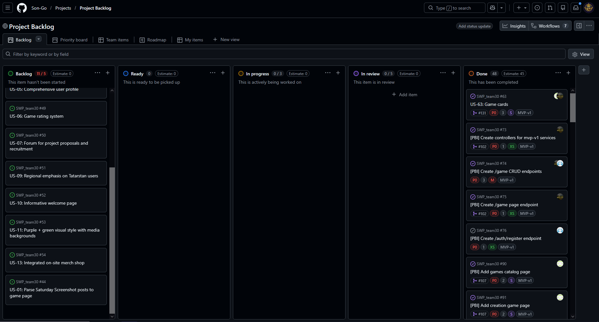
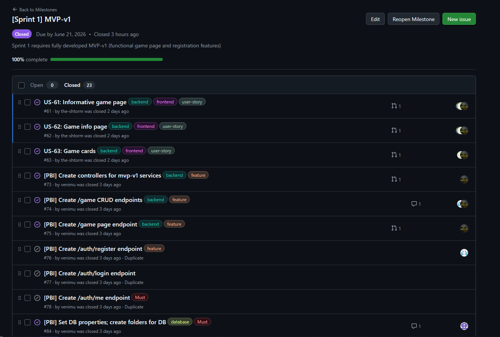
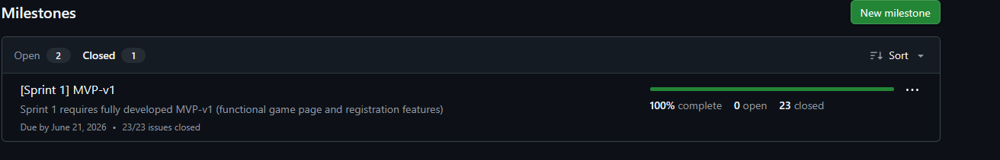
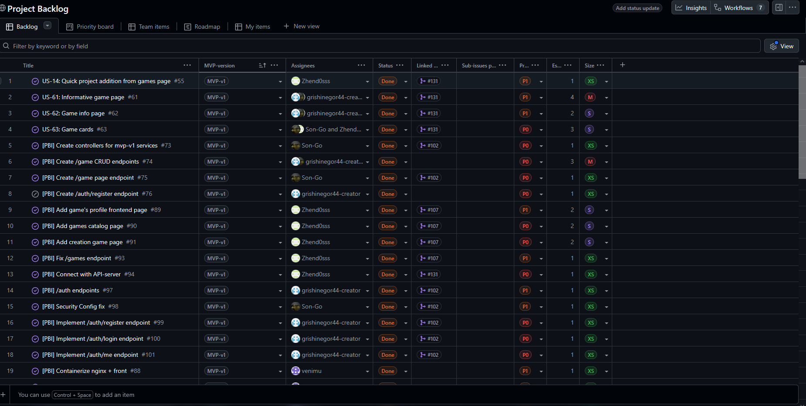
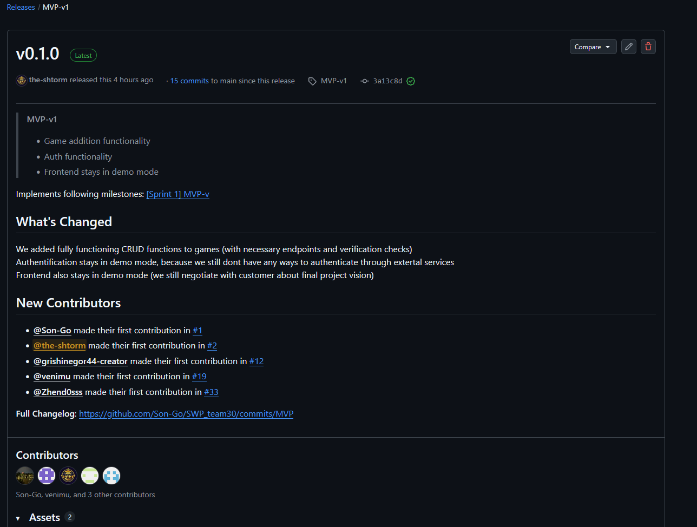
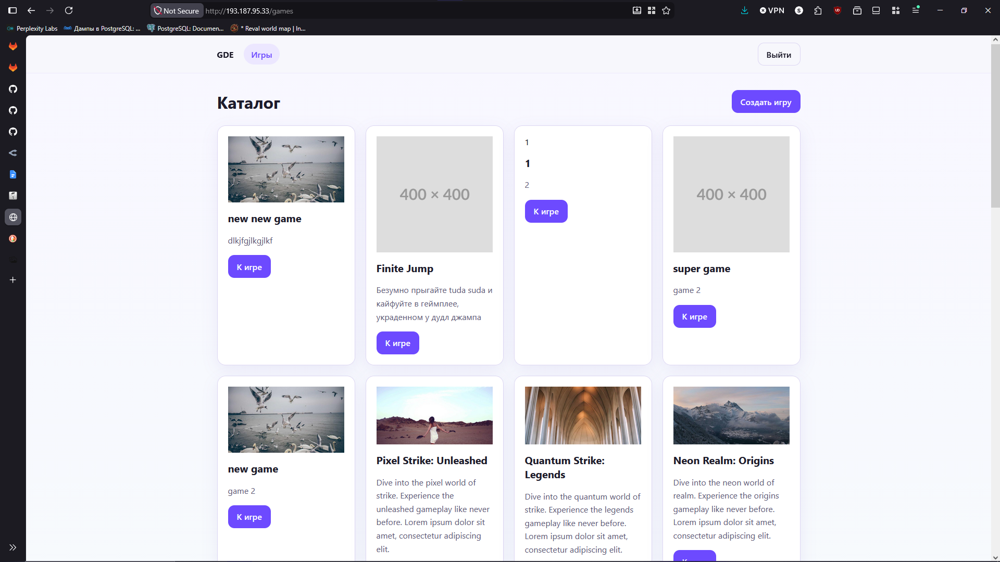
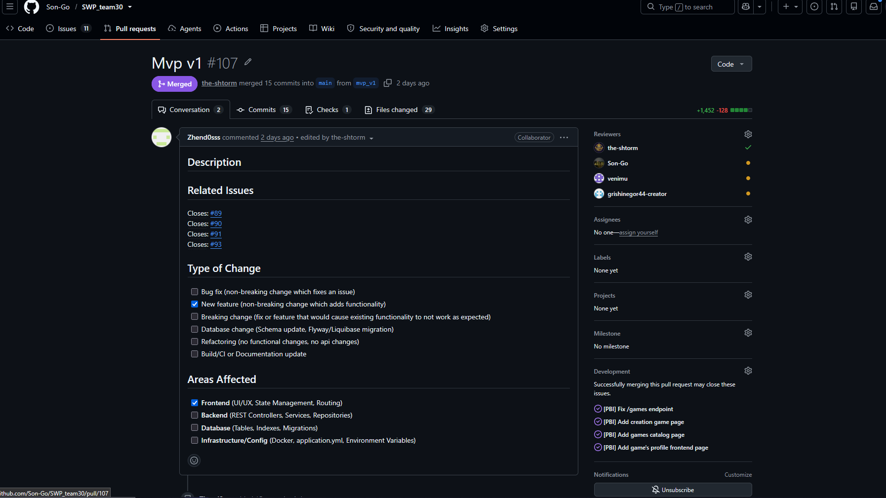

## About project

This is a GDE (Game Dev Evenings) Website project. Purpose of this project is to create website for Gamedev club in Innopolis University. Link to the [**LICENSE**](https://github.com/Son-Go/SWP_team30/blob/0f53ff1e18ba968bdb1a47d9a93787e763ab1cef/LICENSE)

## Link to user-stories

**Story/PBI summary:** team implemented one US from original list and several, discovered during Sprint-1 planning. New PBI and US will be discovered during Sprint-2 planning. All PBI and US state displayed in [docs/user-stories.md](https://github.com/Son-Go/SWP_team30/blob/main/docs/user-stories.md)

Link to historical [`reports/week2/user-stories.md`](https://github.com/Son-Go/SWP_team30/blob/main/reports/week2/user-stories.md)

## Customer feedback

According to customer feedback, MVP-v1 concentrated on /games page and necessary funcitions (authentification, game creation, game list)

## Backlog

- [Product backlog](https://github.com/users/Son-Go/projects/2/views/1) 45 points
- [Sprint backlog](https://github.com/Son-Go/SWP_team30/milestone/1) 45 points
- [MVP-v1 scope](https://github.com/users/Son-Go/projects/2/views/1?layout=table&visibleFields=%5B%22Title%22%2C360083661%2C%22Assignees%22%2C%22Status%22%2C%22Linked+pull+requests%22%2C%22Sub-issues+progress%22%2C359961827%2C359961829%2C359961828%5D&sortedBy%5Bdirection%5D=asc&sortedBy%5BcolumnId%5D=360083661)

## MVP-v1 scope description

Customer requested mvp-v1 to be concentrated om /game page functionality, so in MVP-v1 user stories connected to this page and game creation/reading functions were implemented (for full US and pbi description open [docs/user-stories.md](https://github.com/Son-Go/SWP_team30/blob/main/docs/user-stories.md))

## PBI/Issue statuses && task decomposition

PBI and other issues follows conventional statuses, types etc. approach. PBI are either US decomposed to frontend/backend/devOps parts, or other organizational tasks

## MVP-version tracking
MVP versions can be tracked in releases page or by special tag MVP-vX in backlog

## Milestone usage
Milestones were used to split work into understandable chunks, where each chunk represent new MVP or part of other MVP

## Roadmap

Roadmap [link](https://github.com/Son-Go/SWP_team30/blob/eabd308f67448ead24173caed28d1f0c145c960f/docs/roadmap.md)

Current sprint was centered on /games page. Next will be centered on /events page and /games page finishing

## Verification evidence

Because this sprint has at least dozen on completed PBI, Report will not have info about completed PBI, but all info can be founded on [MVP-v1 scope](https://github.com/users/Son-Go/projects/2/views/1?layout=table&visibleFields=%5B%22Title%22%2C360083661%2C%22Assignees%22%2C%22Status%22%2C%22Linked+pull+requests%22%2C%22Sub-issues+progress%22%2C359961827%2C359961829%2C359961828%5D&sortedBy%5Bdirection%5D=asc&sortedBy%5BcolumnId%5D=360083661), where all US and PBI are sorted by MVP-v1 and linked to required commits, pull requests with verification evidences

## Summary of current status

Currently product stays in early MVP state, where only 1/4 necessary modules was completed at least in some way. Other pages will be completed in further sprints (as well as final functionality of /games page)

## Next steps

In future sprints team will implement event parsing, other /games page functionality (final visual style, user profile, admin page)

## Team activity

Due to huge amount of closed issues (44 at report writing moment), instead of table with contribuition, link to github insigts will be [provided](https://github.com/Son-Go/SWP_team30/graphs/contributors?from=3%2F21%2F2026)

During week each team member closed several issues reviewed several commits. All team members fulfilled requirements on at least 1 PR, 1 review and 1 closed issue

[Link to all issues](https://github.com/Son-Go/SWP_team30/issues)

## Links
- Release [v.0.1.0](https://github.com/Son-Go/SWP_team30/releases/tag/MVP-v1) (after publishing all docs, release v0.1.1 will be awailable)
- [CHANGELOG.md](https://github.com/Son-Go/SWP_team30/blob/main/CHANGELOG.md)
- [Process_Requirements.md](https://gitlab.pg.innopolis.university/swp_26/swp_26/-/blob/main/Process_Requirements.md)
- [definition-of-done.md](https://github.com/Son-Go/SWP_team30/blob/main/docs/definition-of-done.md)
- [roadmap.md](https://github.com/Son-Go/SWP_team30/blob/main/docs/roadmap.md)
- [issue templates folder](https://github.com/Son-Go/SWP_team30/tree/main/.github/ISSUE_TEMPLATE)
- Old PR/MR templated were replaced with [new, extended, issue linked template](https://github.com/Son-Go/SWP_team30/blob/main/.github/pull_request_template.md)
- [MVP-v1 deployment](http://193.187.95.33)
- [access instructions](https://github.com/Son-Go/SWP_team30#local-setup-instructions)
- [transcript (github removes new lines between phrases)](https://github.com/Son-Go/SWP_team30/blob/main/reports/week3/customer-review-transcript.md)
- [summary](https://github.com/Son-Go/SWP_team30/blob/main/reports/week3/customer-review-summary.md)
- [reflection](https://github.com/Son-Go/SWP_team30/blob/main/reports/week3/reflection.md)
- [retrospective](https://github.com/Son-Go/SWP_team30/blob/main/reports/week3/retrospective.md)
- [llm-report](https://github.com/Son-Go/SWP_team30/blob/main/reports/week3/llm-report.md)
- [video demo](https://disk.yandex.ru/i/_iFYFPoW0nBFJg)

## Root README

Link to documents, descriptions and access instructions in the root [`README.md`](https://github.com/Son-Go/SWP_team30/blob/main/README.md)

## Screenshots

### Product backlog

### Sprint backlog

### Sprint milestone

### MVP verstion field

### Release

### Delivered mvp

### Example issue

